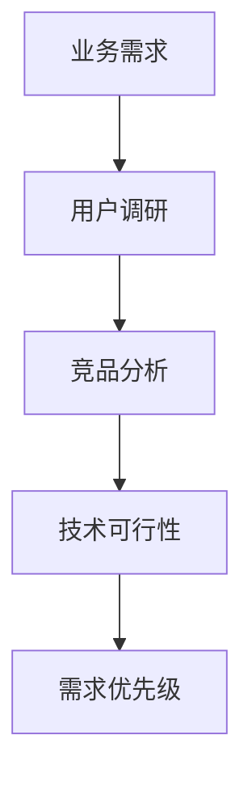
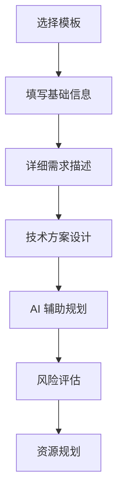
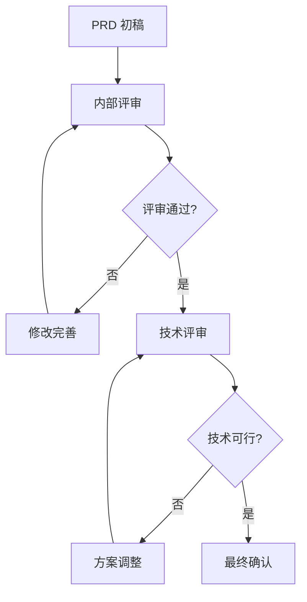
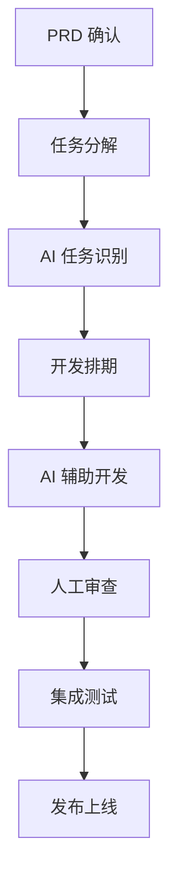

# PRD 文档管理体系

本目录包含 Wishing-PIM 项目的产品需求文档 (Product Requirements Document) 管理体系，旨在规范化需求管理流程，提升 AI 辅助开发效率。

## 📁 目录结构

```
PRD/
├── README.md                 # 本文档
├── core/                     # 核心功能 PRD
│   └── P0-core-ai-document-processing-v1.0.md
├── features/                 # 功能特性 PRD
├── versions/                 # 版本规划文档
│   └── v1.0-mvp.md
├── templates/                # PRD 模板
│   ├── feature-template.md   # 功能 PRD 模板
│   └── epic-template.md      # 史诗 PRD 模板
└── archive/                  # 已废弃的 PRD
```

## 📋 文档分类说明

### Core (核心功能)
存放系统核心功能的 PRD 文档，这些功能是产品的基础能力，优先级通常为 P0。

**特点：**
- 业务关键性高
- 技术复杂度中等到高
- 影响范围广
- 需要重点投入资源

### Features (功能特性)
存放产品功能特性的 PRD 文档，这些功能用于增强用户体验或扩展产品能力。

**特点：**
- 用户价值明确
- 相对独立
- 可以分阶段实现
- 优先级 P1-P2

### Versions (版本规划)
存放产品版本规划文档，包括 MVP、主要版本更新和路线图规划。

**特点：**
- 宏观视角
- 时间导向
- 资源规划
- 里程碑管理

### Templates (模板)
提供标准化的 PRD 模板，确保文档格式统一，提升编写效率。

### Archive (归档)
存放已废弃或过时的 PRD 文档，保留历史记录。

## 🏷️ 命名规范

### 文件命名格式
```
[优先级]-[分类]-[功能名称]-[版本].md
```

**示例：**
- `P0-core-user-auth-v1.0.md`
- `P1-feature-ai-assistant-v1.1.md`
- `P2-enhancement-mobile-ui-v2.0.md`

### 优先级定义
- **P0**: 核心功能，必须实现
- **P1**: 重要功能，应该实现
- **P2**: 增强功能，可以实现
- **P3**: 未来功能，暂不实现

### 分类标识
- **core**: 核心功能
- **feature**: 功能特性
- **enhancement**: 功能增强
- **integration**: 集成功能
- **optimization**: 性能优化

## 🚀 AI 辅助开发指南

### 任务分工原则

**AI 主导任务 (80% 自动化):**
- 基础代码生成
- 样板文件创建
- 单元测试编写
- API 文档生成
- 配置文件生成

**AI 辅助任务 (50% 自动化):**
- 业务逻辑实现
- 复杂查询优化
- 错误处理机制
- 性能优化建议

**人工主导任务 (20% 自动化):**
- 架构设计决策
- 用户体验设计
- 安全策略制定
- 业务流程梳理

### 与 AI Agent 沟通模板

```markdown
## 任务描述
**功能**: [具体要实现的功能]
**技术栈**: [使用的技术和框架]
**输入**: [数据格式和来源]
**输出**: [期望的结果格式]
**约束**: [性能、安全、兼容性要求]
**参考**: [相关 PRD 文档路径]

## 实现要求
- 遵循项目代码规范
- 使用现有的技术栈
- 确保类型安全
- 添加适当的错误处理
- 编写单元测试

## 验收标准
- [ ] 功能正常运行
- [ ] 测试覆盖率 > 80%
- [ ] 代码审查通过
- [ ] 性能指标达标
```

## 📝 PRD 编写最佳实践

### 1. 使用模板
- 从 `templates/` 目录选择合适的模板
- 根据功能复杂度选择 feature 或 epic 模板
- 保持文档结构的一致性

### 2. 明确 AI 辅助点
- 在每个 PRD 中明确标注哪些任务适合 AI 处理
- 提供具体的技术实现建议
- 预估 AI 自动化程度

### 3. 量化指标
- 设定明确的验收标准
- 定义可衡量的成功指标
- 建立质量检查点

### 4. 风险管理
- 识别技术和业务风险
- 制定应对策略
- 设置风险监控点

### 5. 版本控制
- 记录文档变更历史
- 维护版本兼容性
- 及时归档过时文档

## 🔄 工作流程

### 1. 需求收集


### 2. PRD 编写


### 3. 评审流程


### 4. 开发执行


## 📊 质量检查清单

### PRD 文档质量
- [ ] 使用标准模板格式
- [ ] 命名规范符合要求
- [ ] 需求描述清晰具体
- [ ] 验收标准可衡量
- [ ] AI 辅助点明确标注
- [ ] 风险评估完整
- [ ] 资源规划合理

### 技术方案质量
- [ ] 技术选型合理
- [ ] 架构设计清晰
- [ ] 性能指标明确
- [ ] 安全要求完备
- [ ] 兼容性考虑周全

### 项目管理质量
- [ ] 时间规划合理
- [ ] 里程碑设置清晰
- [ ] 资源配置充足
- [ ] 风险应对策略完备

## 🔗 相关文档

- [AI 开发指南](../AI-reply/ai-development-guide.md)
- [技术架构文档](../TRD/)
- [项目开发规范](../)
- [Inngest 工作流文档](../inngest.md)

## 📞 联系方式

如有任何关于 PRD 管理体系的问题或建议，请联系：
- 产品团队：负责 PRD 内容和流程
- 技术团队：负责技术方案评审
- 项目管理：负责资源协调和进度管理

---

**最后更新**: 2024-01-15  
**维护者**: 产品团队