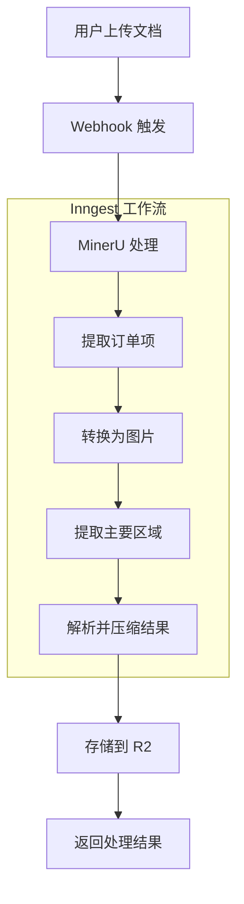
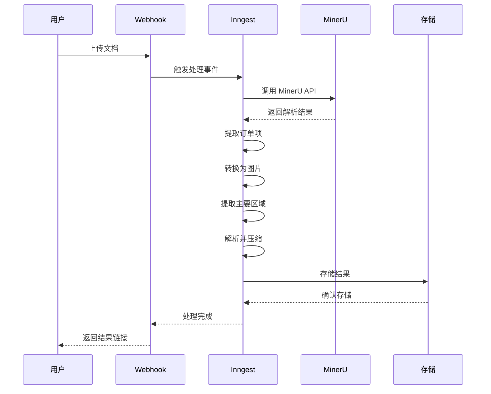

# AI 文档处理核心功能 PRD

**文档信息**
- 创建日期：2024-01-15
- 最后更新：2024-01-15
- 版本：v1.0
- 优先级：P0
- 负责人：产品团队
- 状态：需求确认

## 1. 背景与目标

### 1.1 业务背景
当前 Wishing-PIM 系统需要处理大量的文档数据，包括 PDF、图片、文本等多种格式。用户在信息管理过程中，经常需要从这些文档中提取关键信息、进行格式转换和内容分析。

### 1.2 用户痛点
- 手动处理文档效率低下，耗时费力
- 文档格式多样，缺乏统一的处理流程
- 信息提取准确性依赖人工，容易出错
- 无法批量处理大量文档

### 1.3 解决目标
- 实现文档的自动化智能处理
- 提升信息提取的准确性和效率
- 支持多种文档格式的统一处理
- 建立可扩展的 AI 处理管道

## 2. 需求描述

### 2.1 功能概述
构建基于 AI 的文档处理核心功能，通过 Inngest 工作流引擎，实现文档的智能解析、内容提取、格式转换和结构化存储。

### 2.2 用户故事
```
作为 PIM 系统用户
我希望上传文档后能自动提取关键信息
以便于快速获取所需数据，提高工作效率
```

### 2.3 功能详细说明
#### 2.3.1 核心功能
- [x] PDF 文档解析和内容提取
- [x] 图片格式转换和 OCR 识别
- [x] 主要内容区域检测和提取
- [x] 结构化数据输出和压缩存储

#### 2.3.2 辅助功能
- [ ] 文档预处理和质量检测
- [ ] 多语言文档支持
- [ ] 批量处理队列管理
- [ ] 处理结果的可视化展示

### 2.4 验收标准
- [x] 支持 PDF 格式文档的自动解析
- [x] 图片转换准确率 > 95%
- [x] 内容提取准确率 > 90%
- [x] 单个文档处理时间 < 30秒
- [x] 支持并发处理多个文档

## 3. 技术要求

### 3.1 性能指标
- 响应时间：文档上传后 < 5秒开始处理
- 并发处理：支持 10 个文档同时处理
- 数据处理：支持单个文档最大 50MB
- 吞吐量：每小时处理 > 100 个文档

### 3.2 安全要求
- 文档传输过程加密
- 临时文件自动清理
- 用户数据隔离和权限控制
- 处理日志记录和审计

### 3.3 兼容性要求
- 支持 PDF 1.4 及以上版本
- 支持 JPG、PNG、TIFF 图片格式
- 兼容现有的 Inngest 工作流
- 支持 Cloudflare Workers 部署环境

## 4. 实现方案

### 4.1 技术选型建议
- **工作流引擎**：Inngest（已确定）
- **文档处理**：MinerU + 自定义处理逻辑
- **图片处理**：Canvas API + OCR 服务
- **数据存储**：Cloudflare R2 + D1 数据库
- **API 框架**：Hono.js

### 4.2 AI 辅助开发点
**适合 AI 处理的任务：**
- [x] Inngest 函数样板代码生成
- [x] 事件类型定义和接口生成
- [x] 基础的文件处理逻辑
- [x] 错误处理和重试机制
- [ ] 单元测试用例生成
- [ ] API 文档自动生成

**需要人工处理的任务：**
- [ ] 复杂的文档解析算法优化
- [ ] 性能瓶颈分析和优化
- [ ] 用户体验流程设计
- [ ] 安全策略制定和实施
- [ ] 生产环境监控和告警

### 4.3 架构设计


### 4.4 数据流程


## 5. 风险评估

### 5.1 技术风险
- **MinerU API 稳定性**：影响程度：高 | 应对策略：建立重试机制和备用方案
- **文档格式兼容性**：影响程度：中 | 应对策略：逐步扩展支持格式
- **处理性能瓶颈**：影响程度：中 | 应对策略：优化算法和并行处理

### 5.2 业务风险
- **用户数据安全**：影响程度：高 | 应对策略：加强数据加密和访问控制
- **处理准确率不达标**：影响程度：高 | 应对策略：建立质量检测和人工审核机制
- **成本控制**：影响程度：中 | 应对策略：优化资源使用和处理效率

## 6. 项目规划

### 6.1 开发周期
- 需求分析：2 天（已完成）
- 设计阶段：3 天
- 开发阶段：10 天
- 测试阶段：5 天
- 部署上线：2 天

### 6.2 里程碑
- [x] 需求确认 - 2024-01-15
- [x] Inngest 函数结构设计 - 2024-01-16
- [x] 核心函数实现 - 2024-01-17
- [ ] 集成测试完成 - 2024-01-25
- [ ] 正式上线 - 2024-01-30

### 6.3 资源需求
- 后端开发：15 人天
- 测试：5 人天
- DevOps：3 人天
- 产品：2 人天

## 7. 当前实现状态

### 7.1 已完成功能
基于之前的重构工作，已经实现了以下 Inngest 函数：

1. **PDF 订单项提取** (`extract-order-items.ts`)
   - 事件：`pdf/extract-order-items`
   - 功能：从 PDF 中提取订单相关信息

2. **PDF 转图片** (`convert-to-img.ts`)
   - 事件：`pdf/convert-to-img`
   - 功能：将 PDF 页面转换为图片格式

3. **主要区域提取** (`extract-main-bbox.ts`)
   - 事件：`pdf/extract-main-bbox`
   - 功能：检测和提取文档的主要内容区域

4. **结果解析压缩** (`parse-to-zipped-result.ts`)
   - 事件：`pdf/parse-to-zipped-result`
   - 功能：解析处理结果并压缩存储

5. **MinerU Webhook** (`minerU.ts`)
   - 事件：`webhooks/minerU`
   - 功能：接收 MinerU 处理完成的回调

### 7.2 技术架构特点
- **分散式类型管理**：每个函数文件包含独立的事件类型定义
- **模块化组织**：PDF 功能组织在独立模块中
- **统一导出**：通过 index.ts 提供清晰的导出结构
- **类型安全**：完整的 TypeScript 类型定义

### 7.3 下一步工作
- [ ] 实现具体的业务逻辑
- [ ] 添加错误处理和重试机制
- [ ] 集成 MinerU API 调用
- [ ] 添加监控和日志记录
- [ ] 编写集成测试

## 8. 附录

### 8.1 相关文档
- [Inngest 函数架构文档](../../../docs/inngest.md)
- [MinerU API 文档](https://mineru-api-docs.example.com)
- [Cloudflare Workers 部署指南](../TRD/architecture/)

### 8.2 参考资料
- Inngest 官方文档
- PDF 处理最佳实践
- OCR 技术调研报告

### 8.3 变更记录
| 版本 | 日期 | 变更内容 | 变更人 |
|------|------|----------|--------|
| v1.0 | 2024-01-15 | 初始版本，基于已实现的 Inngest 函数结构 | 产品团队 |

---

**审批流程**
- [x] 产品经理审批
- [x] 技术负责人审批
- [ ] 项目经理审批
- [ ] 最终确认