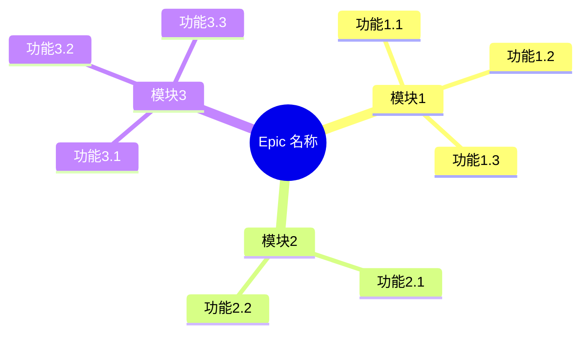
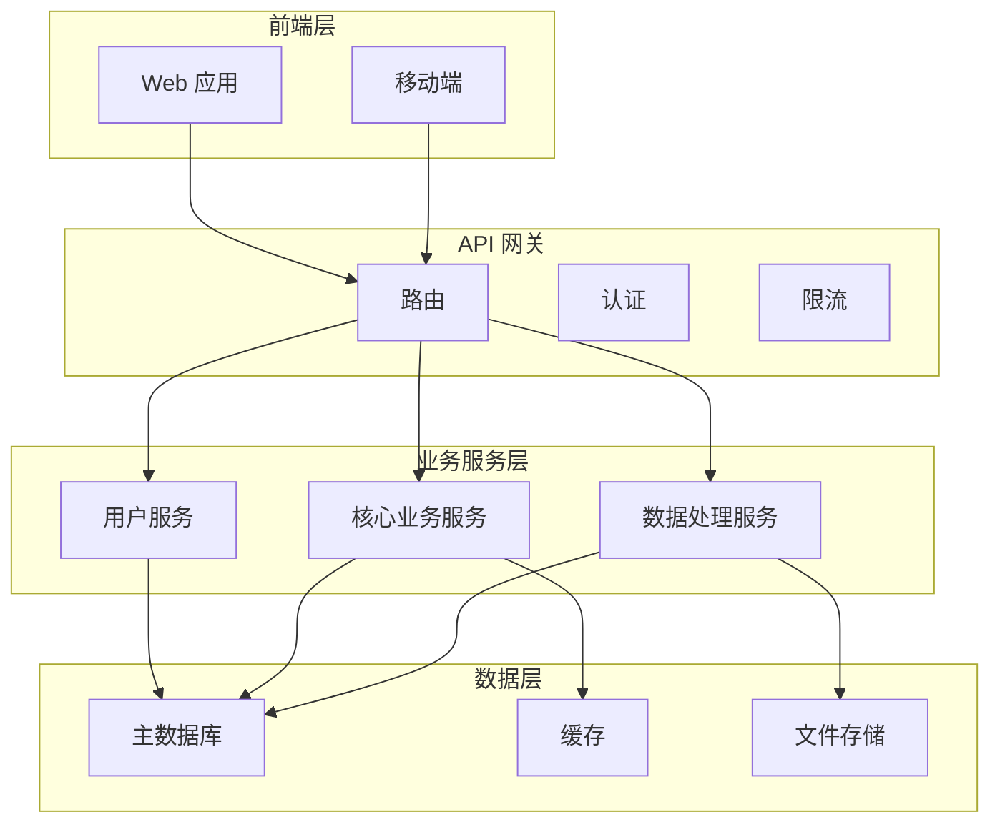
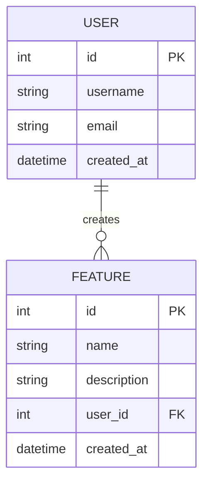
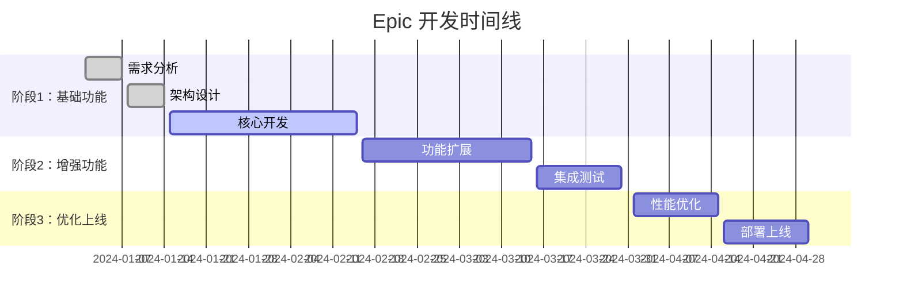

# [史诗功能名称] Epic PRD

**文档信息**
- 创建日期：[YYYY-MM-DD]
- 最后更新：[YYYY-MM-DD]
- 版本：v1.0
- 优先级：[P0/P1/P2]
- 负责人：[姓名]
- 状态：[规划中/设计中/开发中/已完成]
- 预计周期：[X] 个月

## 1. Epic 概述

### 1.1 业务价值
- 描述这个 Epic 对业务的核心价值
- 量化预期收益（用户增长、收入提升等）

### 1.2 战略意义
- 在产品路线图中的位置
- 与公司战略目标的关联

### 1.3 用户影响
- 影响的用户群体
- 预期的用户体验改进

## 2. 功能拆解

### 2.1 核心功能模块

### 2.2 功能优先级矩阵
| 功能模块 | 业务价值 | 技术复杂度 | 优先级 | 预计工期 |
|----------|----------|------------|--------|----------|
| 模块1 | 高 | 中 | P0 | 4周 |
| 模块2 | 中 | 低 | P1 | 2周 |
| 模块3 | 高 | 高 | P0 | 6周 |

### 2.3 子功能 PRD 列表
- [ ] [P0-core-功能1-v1.0.md](../core/)
- [ ] [P1-feature-功能2-v1.0.md](../features/)
- [ ] [P0-core-功能3-v1.0.md](../core/)

## 3. 技术架构

### 3.1 系统架构图

### 3.2 数据模型设计

### 3.3 AI 辅助开发策略

**AI 主导任务（80% 自动化）：**
- 基础 CRUD 操作实现
- 数据模型和 Migration 生成
- API 接口样板代码
- 单元测试和集成测试
- 配置文件和部署脚本
- 基础 UI 组件实现

**AI 辅助任务（50% 自动化）：**
- 复杂查询逻辑实现
- 业务规则验证
- 性能优化建议
- 安全策略实现
- 错误处理机制

**人工主导任务（20% 自动化）：**
- 核心业务逻辑设计
- 用户体验优化
- 系统架构决策
- 性能瓶颈分析
- 安全风险评估

## 4. 开发计划

### 4.1 阶段规划

### 4.2 里程碑检查点
- **M1 - 架构确认** (Week 2)
  - [ ] 技术架构评审通过
  - [ ] 数据模型设计确认
  - [ ] AI 辅助开发工具链搭建

- **M2 - 核心功能完成** (Week 6)
  - [ ] 核心 API 开发完成
  - [ ] 基础 UI 实现完成
  - [ ] 单元测试覆盖率 > 80%

- **M3 - 功能集成** (Week 10)
  - [ ] 所有功能模块集成完成
  - [ ] 端到端测试通过
  - [ ] 性能测试达标

- **M4 - 生产就绪** (Week 12)
  - [ ] 安全审计通过
  - [ ] 生产环境部署完成
  - [ ] 监控和告警配置完成

## 5. 资源规划

### 5.1 团队配置
- **产品经理**：1人，全程参与
- **架构师**：1人，前4周重点参与
- **前端开发**：2人，6-12周
- **后端开发**：3人，4-12周
- **测试工程师**：1人，8-12周
- **DevOps**：1人，10-12周

### 5.2 AI 工具预算
- **代码生成工具**：$500/月
- **测试自动化**：$300/月
- **文档生成**：$200/月
- **代码审查**：$400/月

### 5.3 技术债务管理
- 每个 Sprint 预留 20% 时间处理技术债务
- AI 生成代码的人工审查和优化
- 定期重构和代码质量提升

## 6. 风险管理

### 6.1 技术风险
| 风险项 | 概率 | 影响 | 风险等级 | 应对策略 |
|--------|------|------|----------|----------|
| AI 生成代码质量问题 | 中 | 中 | 中 | 建立代码审查机制 |
| 第三方服务依赖 | 低 | 高 | 中 | 准备备选方案 |
| 性能瓶颈 | 中 | 高 | 高 | 提前性能测试 |

### 6.2 业务风险
| 风险项 | 概率 | 影响 | 风险等级 | 应对策略 |
|--------|------|------|----------|----------|
| 需求变更 | 高 | 中 | 高 | 敏捷开发，快速响应 |
| 竞品抢先 | 中 | 高 | 高 | 加快 MVP 交付 |
| 用户接受度 | 中 | 高 | 高 | 早期用户测试 |

## 7. 成功指标

### 7.1 技术指标
- 代码覆盖率：> 80%
- API 响应时间：< 200ms
- 系统可用性：> 99.9%
- 部署频率：每周至少1次

### 7.2 业务指标
- 用户采用率：> 60%
- 用户满意度：> 4.5/5
- 功能使用率：> 40%
- 用户留存率：> 80%

### 7.3 AI 效率指标
- AI 代码生成比例：> 60%
- 开发效率提升：> 40%
- 代码质量评分：> 8.5/10
- 测试自动化覆盖：> 70%

## 8. 后续规划

### 8.1 版本演进
- **v1.0**：核心功能 MVP
- **v1.1**：用户体验优化
- **v1.2**：性能和稳定性提升
- **v2.0**：功能扩展和生态集成

### 8.2 技术演进
- AI 辅助开发能力持续提升
- 自动化测试和部署完善
- 微服务架构优化
- 数据驱动的产品迭代

---

**审批记录**
- [ ] 产品总监审批
- [ ] 技术总监审批
- [ ] 项目管理办公室审批
- [ ] 最终确认并启动