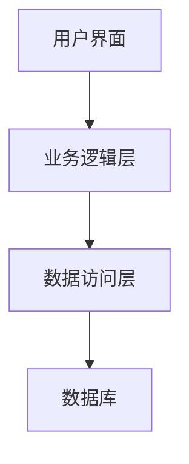
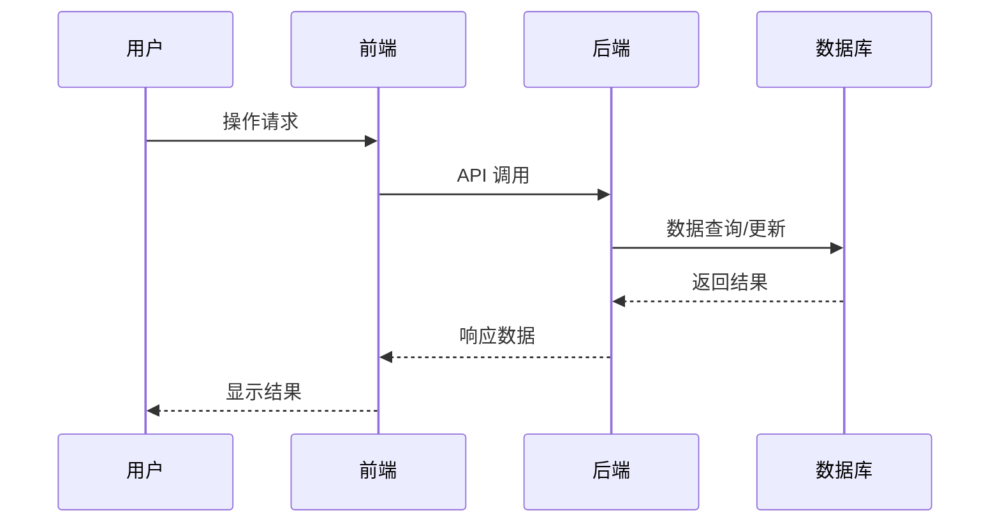

# [功能名称] PRD

**文档信息**
- 创建日期：[YYYY-MM-DD]
- 最后更新：[YYYY-MM-DD]
- 版本：v1.0
- 优先级：[P0/P1/P2]
- 负责人：[姓名]
- 状态：[草稿/评审中/已确认/开发中/已完成]

## 1. 背景与目标

### 1.1 业务背景
- 描述当前业务场景和问题
- 说明为什么需要这个功能

### 1.2 用户痛点
- 列出用户当前遇到的具体问题
- 量化问题的影响程度

### 1.3 解决目标
- 明确要达成的业务目标
- 定义成功的衡量标准

## 2. 需求描述

### 2.1 功能概述
- 用一段话描述功能的核心价值
- 说明功能的适用场景

### 2.2 用户故事
```
作为 [用户角色]
我希望 [功能描述]
以便于 [价值/目标]
```

### 2.3 功能详细说明
#### 2.3.1 核心功能
- [ ] 功能点1：详细描述
- [ ] 功能点2：详细描述
- [ ] 功能点3：详细描述

#### 2.3.2 辅助功能
- [ ] 辅助功能1：详细描述
- [ ] 辅助功能2：详细描述

### 2.4 验收标准
- [ ] 验收条件1
- [ ] 验收条件2
- [ ] 验收条件3

## 3. 技术要求

### 3.1 性能指标
- 响应时间：< [X]ms
- 并发用户：支持 [X] 用户同时使用
- 数据处理：支持 [X] 条记录

### 3.2 安全要求
- 数据加密要求
- 权限控制要求
- 审计日志要求

### 3.3 兼容性要求
- 浏览器兼容性
- 移动端适配
- API 版本兼容

## 4. 实现方案

### 4.1 技术选型建议
- 前端技术栈
- 后端技术栈
- 数据库选择
- 第三方服务

### 4.2 AI 辅助开发点
**适合 AI 处理的任务：**
- [ ] 基础 CRUD 代码生成
- [ ] 表单验证逻辑
- [ ] API 接口实现
- [ ] 单元测试编写

**需要人工处理的任务：**
- [ ] 复杂业务逻辑设计
- [ ] 性能优化策略
- [ ] 用户体验设计
- [ ] 安全策略制定

### 4.3 架构设计


### 4.4 数据流程


## 5. 风险评估

### 5.1 技术风险
- **风险1**：描述 | 影响程度：[高/中/低] | 应对策略
- **风险2**：描述 | 影响程度：[高/中/低] | 应对策略

### 5.2 业务风险
- **风险1**：描述 | 影响程度：[高/中/低] | 应对策略
- **风险2**：描述 | 影响程度：[高/中/低] | 应对策略

## 6. 项目规划

### 6.1 开发周期
- 需求分析：[X] 天
- 设计阶段：[X] 天
- 开发阶段：[X] 天
- 测试阶段：[X] 天
- 部署上线：[X] 天

### 6.2 里程碑
- [ ] 需求确认 - [日期]
- [ ] 设计完成 - [日期]
- [ ] 开发完成 - [日期]
- [ ] 测试完成 - [日期]
- [ ] 正式上线 - [日期]

### 6.3 资源需求
- 前端开发：[X] 人天
- 后端开发：[X] 人天
- 测试：[X] 人天
- 设计：[X] 人天

## 7. 附录

### 7.1 相关文档
- [技术架构文档](../TRD/architecture/)
- [API 规范文档](../TRD/api-specs/)
- [集成方案文档](../TRD/integration/)

### 7.2 参考资料
- 竞品分析
- 用户调研报告
- 技术调研报告

### 7.3 变更记录
| 版本 | 日期 | 变更内容 | 变更人 |
|------|------|----------|--------|
| v1.0 | [日期] | 初始版本 | [姓名] |

---

**审批流程**
- [ ] 产品经理审批
- [ ] 技术负责人审批
- [ ] 项目经理审批
- [ ] 最终确认