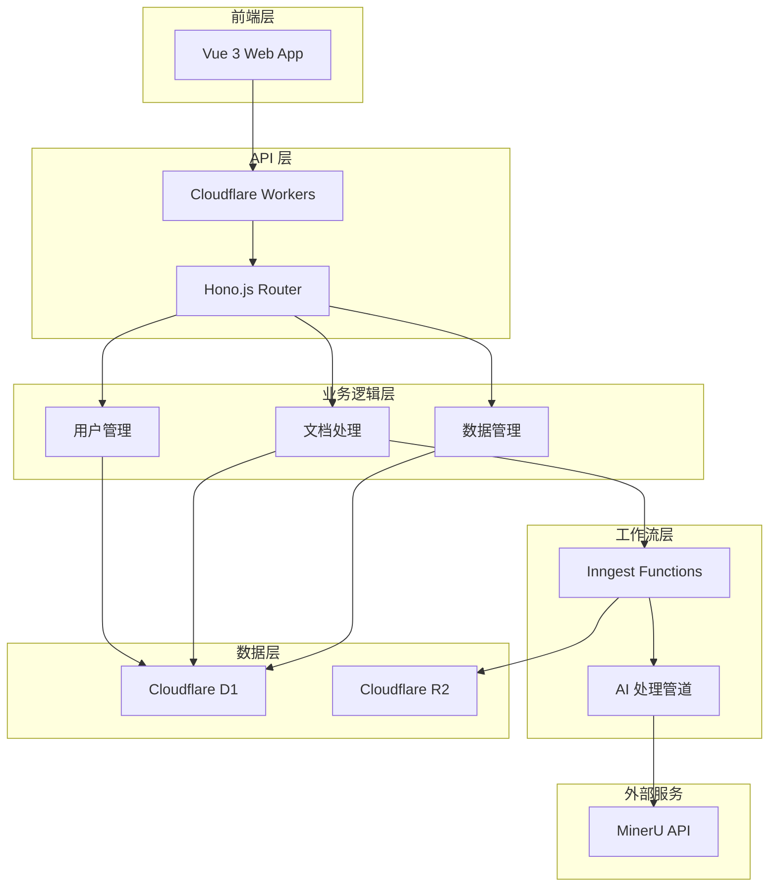

# Wishing-PIM v1.0 MVP 版本规划

**版本信息**
- 版本号：v1.0.0
- 发布类型：MVP (Minimum Viable Product)
- 计划发布：2024-03-01
- 开发周期：8 周
- 状态：规划中

## 1. MVP 目标

### 1.1 核心价值主张
为用户提供基于 AI 的个人信息管理系统，实现文档的智能处理、信息提取和结构化存储，显著提升信息管理效率。

### 1.2 目标用户
- **主要用户**：需要处理大量文档的知识工作者
- **次要用户**：小型团队和个人用户
- **用户规模**：初期目标 100+ 活跃用户

### 1.3 成功指标
- 用户注册转化率：> 15%
- 文档处理成功率：> 90%
- 用户日活跃度：> 60%
- 用户满意度评分：> 4.0/5

## 2. 核心功能范围

### 2.1 必须包含功能 (Must Have)

#### 2.1.1 用户管理
- [x] 用户注册和登录
- [x] 基础用户信息管理
- [ ] 简单的权限控制

#### 2.1.2 AI 文档处理 (P0)
- [x] PDF 文档上传和解析
- [x] 图片格式转换
- [x] 内容提取和结构化
- [x] 处理结果存储
- [ ] 批量文档处理

#### 2.1.3 数据管理
- [ ] 文档列表和搜索
- [ ] 基础的标签和分类
- [ ] 处理历史记录

#### 2.1.4 基础 UI
- [ ] 响应式 Web 界面
- [ ] 文档上传界面
- [ ] 处理结果展示
- [ ] 基础的用户设置

### 2.2 应该包含功能 (Should Have)

#### 2.2.1 增强处理能力
- [ ] 多种文档格式支持
- [ ] OCR 文字识别
- [ ] 智能内容分类

#### 2.2.2 用户体验优化
- [ ] 处理进度实时显示
- [ ] 错误处理和用户反馈
- [ ] 基础的帮助文档

### 2.3 可以包含功能 (Could Have)

#### 2.3.1 高级功能
- [ ] API 接口开放
- [ ] 数据导出功能
- [ ] 简单的数据分析

#### 2.3.2 集成功能
- [ ] 第三方存储集成
- [ ] 邮件通知

### 2.4 暂不包含功能 (Won't Have)

- 移动端应用
- 多租户支持
- 高级分析和报表
- 工作流自定义
- 团队协作功能

## 3. 技术架构

### 3.1 技术栈选择

**前端：**
- Vue 3 + TypeScript
- Vite 构建工具
- UnoCSS 样式框架
- Pinia 状态管理

**后端：**
- Cloudflare Workers
- Hono.js 框架
- Drizzle ORM
- Inngest 工作流引擎

**数据存储：**
- Cloudflare D1 (SQLite)
- Cloudflare R2 (对象存储)

**AI 服务：**
- MinerU API
- 自定义文档处理逻辑

### 3.2 系统架构图

### 3.3 AI 辅助开发计划

**第一阶段：基础设施 (Week 1-2)**
- AI 生成项目脚手架和配置
- 自动生成基础 CRUD 操作
- 数据库 Schema 和 Migration 生成

**第二阶段：核心功能 (Week 3-5)**
- AI 辅助实现 Inngest 函数逻辑
- 自动生成 API 接口和文档
- 基础 UI 组件生成

**第三阶段：集成优化 (Week 6-7)**
- AI 辅助测试用例编写
- 性能优化建议实施
- 错误处理和监控代码生成

**第四阶段：部署上线 (Week 8)**
- 自动化部署脚本生成
- 监控和告警配置
- 文档和用户指南生成

## 4. 开发计划

### 4.1 Sprint 规划

**Sprint 1 (Week 1-2): 基础设施**
- [x] 项目架构搭建
- [x] Inngest 函数结构设计
- [ ] 数据库设计和初始化
- [ ] 基础 API 框架搭建
- [ ] 前端项目初始化

**Sprint 2 (Week 3-4): 核心功能开发**
- [ ] 用户认证系统
- [ ] 文档上传功能
- [ ] AI 处理管道实现
- [ ] 基础 UI 界面

**Sprint 3 (Week 5-6): 功能集成**
- [ ] 前后端集成
- [ ] 文档处理流程完善
- [ ] 用户界面优化
- [ ] 错误处理机制

**Sprint 4 (Week 7-8): 测试和部署**
- [ ] 集成测试
- [ ] 性能优化
- [ ] 生产环境部署
- [ ] 用户验收测试

### 4.2 关键里程碑

- **M1 - 技术验证** (Week 2)
  - [x] Inngest 工作流搭建完成
  - [ ] MinerU API 集成验证
  - [ ] 基础数据流程打通

- **M2 - 功能原型** (Week 4)
  - [ ] 端到端文档处理流程
  - [ ] 基础用户界面可用
  - [ ] 核心功能演示就绪

- **M3 - Beta 版本** (Week 6)
  - [ ] 所有核心功能完成
  - [ ] 基础测试通过
  - [ ] 内部用户试用

- **M4 - 正式发布** (Week 8)
  - [ ] 生产环境稳定运行
  - [ ] 用户文档完善
  - [ ] 监控告警完备

## 5. 资源规划

### 5.1 团队配置
- **产品经理**：1人，全程参与
- **全栈开发**：2人，主要开发力量
- **AI 工程师**：1人，AI 功能优化
- **测试工程师**：0.5人，测试支持
- **DevOps**：0.5人，部署和运维

### 5.2 预算估算
- **开发成本**：$15,000 (人力成本)
- **基础设施**：$200/月 (Cloudflare 服务)
- **AI 服务**：$500/月 (MinerU + 其他 AI 工具)
- **工具和服务**：$300/月 (开发工具订阅)

### 5.3 AI 工具投入
- **代码生成**：GitHub Copilot, Cursor
- **测试自动化**：AI 测试用例生成
- **文档生成**：自动 API 文档和用户指南
- **代码审查**：AI 代码质量检查

## 6. 风险管理

### 6.1 技术风险
| 风险项 | 概率 | 影响 | 应对策略 |
|--------|------|------|----------|
| MinerU API 不稳定 | 中 | 高 | 建立备用处理方案 |
| Cloudflare 服务限制 | 低 | 中 | 监控使用量，准备扩容 |
| AI 处理准确率不达标 | 中 | 高 | 建立质量检测机制 |

### 6.2 业务风险
| 风险项 | 概率 | 影响 | 应对策略 |
|--------|------|------|----------|
| 用户需求变化 | 高 | 中 | 敏捷开发，快速迭代 |
| 竞品压力 | 中 | 中 | 专注核心差异化功能 |
| 用户获取困难 | 中 | 高 | 早期用户计划 |

### 6.3 时间风险
| 风险项 | 概率 | 影响 | 应对策略 |
|--------|------|------|----------|
| 开发进度延迟 | 中 | 高 | 功能优先级调整 |
| 集成复杂度超预期 | 中 | 中 | 预留缓冲时间 |
| 测试时间不足 | 低 | 中 | 自动化测试覆盖 |

## 7. 质量保证

### 7.1 代码质量
- TypeScript 严格模式
- ESLint + Prettier 代码规范
- 单元测试覆盖率 > 70%
- AI 代码审查辅助

### 7.2 功能质量
- 端到端测试覆盖核心流程
- 用户验收测试
- 性能基准测试
- 安全性检查

### 7.3 用户体验
- 响应式设计适配
- 加载性能优化
- 错误处理友好
- 用户反馈收集

## 8. 发布计划

### 8.1 发布策略
- **内测版** (Week 6): 内部团队使用
- **Beta 版** (Week 7): 邀请 20 位早期用户
- **正式版** (Week 8): 公开发布

### 8.2 发布检查清单
- [ ] 所有核心功能测试通过
- [ ] 性能指标达标
- [ ] 安全审计完成
- [ ] 用户文档完善
- [ ] 监控告警配置
- [ ] 备份恢复方案

### 8.3 发布后计划
- 用户反馈收集和分析
- 紧急问题修复
- v1.1 版本规划启动
- 用户增长策略执行

---

**版本负责人**：产品团队  
**技术负责人**：开发团队  
**最后更新**：2024-01-15